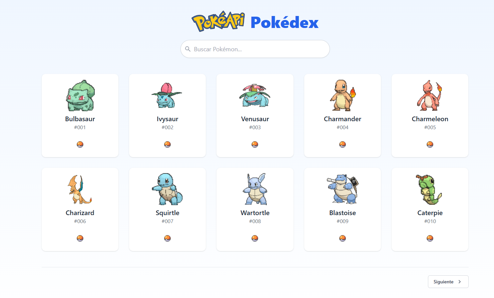
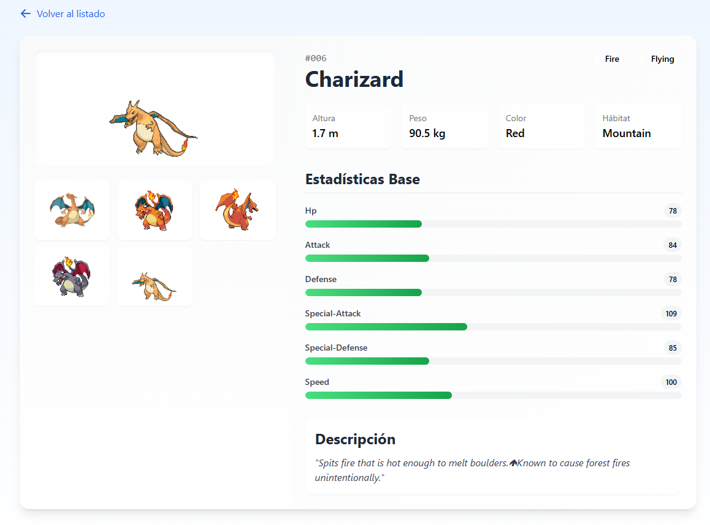

# Aplicación Web de Pokémon

Esta es una aplicación web desarrollada con Django y Django REST Framework que permite consultar información detallada de Pokémon utilizando la API pública de PokéAPI.
La interfaz web presenta datos visuales como imágenes, estadísticas, tipos, habilidades y una descripción del Pokémon.

## Características principales

- Consulta de Pokémon por ID.
- Visualización de:
  - Imagen oficial, imagen GIF, sprite trasero, sprite brillante.
  - Altura, peso, tipos, habilidades, estadísticas.
  - Color, hábitat y descripción en inglés.
- Interfaz web responsiva con diseño mejorado.
- Iconos de FontAwesome.
- Backend con Django REST Framework (DRF).
- Uso de cache para reducir peticiones a PokéAPI.
- Uso de dataclasses para estructurar las interfaces de datos.

## Capturas

## Requisitos previos

- Python 3.9 o superior
- pip
- Virtualenv (opcional pero recomendado)

## Librerias utilizadas
- Django~=5.1.2
- requests~=2.31.0
- djangorestframework~=3.15.2

## Instalación y ejecución

### 1. Clona el repositorio

- git clone https://github.com/SPEREZB/Pokemon.git
- cd Pokemon

### 2. Instala las dependencias

- pip install -r requirements.txt

### 3. Ejecuta la aplicación

- python manage.py runserver

### 4. Accede a la aplicación web en http://localhost:8000
